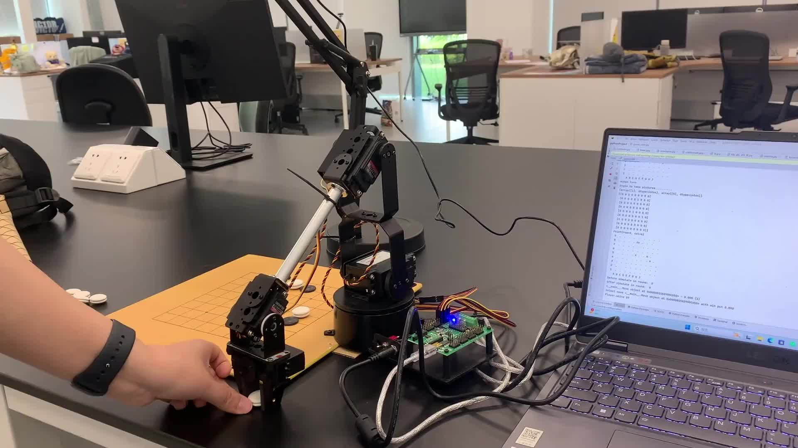

<div align="center">

# Vision-Guided Robotic Arm for 9×9 Go

**A final-year engineering project combining computer vision, Monte Carlo Tree Search, inverse kinematics, and physical robot control.**

Python · OpenCV · MCTS · Robotics · Camera Calibration · Serial Control

</div>

## Demo

<p align="center">
  <a href="demo/robot_arm_fyp.mp4">
    
  </a>
</p>

<p align="center"><strong>▶ Click the image to watch the full demonstration (3:22).</strong></p>

## Overview

This project is a physical human–robot Go prototype built for a 9×9 board. A camera observes the board, OpenCV reconstructs the current position, a Monte Carlo Tree Search (MCTS) agent selects the robot's response, and a servo-driven arm places the chosen stone on the physical board.

The project demonstrates an end-to-end robotics pipeline rather than an isolated algorithm: perception, game-state modelling, AI planning, coordinate conversion, inverse kinematics, actuator commands, and hardware integration all work together in one system.

> 中文简介：本项目是一套 9×9 围棋机械臂原型。系统通过相机识别棋盘与棋子，使用蒙特卡洛树搜索（MCTS）计算落子，再通过逆运动学和串口舵机控制让机械臂完成抓取与落子。

## System Pipeline

```text
Physical Go board
      │ camera frame
      ▼
Camera calibration & distortion correction
      │
      ▼
Board contour + Hough-circle stone detection
      │ board coordinates
      ▼
Go rules engine + MCTS decision making
      │ selected move
      ▼
Board-to-arm coordinate mapping
      │ target pose
      ▼
2D inverse kinematics + servo pulse generation
      │ serial commands
      ▼
SSC-32U controller → robotic arm → physical move
```

## Engineering Highlights

- **Computer vision:** OpenCV camera calibration, lens-distortion correction, contour extraction, Hough-circle detection, and conversion from image-space detections to 9×9 board coordinates.
- **Game AI:** a Go rules engine with liberties, capture, ko checking, pass/resign handling, and Zobrist hashing; MCTS uses selection, expansion, random rollout, and backpropagation.
- **Robotics:** analytical inverse kinematics converts a target board location into shoulder, elbow, wrist, base, and gripper commands.
- **Hardware control:** Python sends timed pulse and speed commands over a serial connection to an SSC-32U servo controller.
- **System integration:** the main program alternates between a camera-observed human move and a robot move selected and executed by the AI.
- **Virtual interface:** a Pygame-based Go board provides a software environment for visualising and testing the game logic.

## Hardware

The source code and linkage dimensions identify the arm as a **Lynxmotion AL5D-style 4-DOF robotic arm with gripper**, driven by an **SSC-32U USB servo controller**. The `AL5D` constants in the inverse-kinematics module use 5.75-inch and 7.375-inch link lengths, while the controller protocol sends channel-specific `P` (pulse width) and `S` (speed) commands.

Lynxmotion is a Canadian robotics brand, not a Japanese manufacturer. The model identification here is based on the code, geometry, controller, and the hardware visible in the demo.

Reference: [Lynxmotion SES-V1 robot arms](https://www.lynxmotion.com/ses-v1-robot-arms/)

## Repository Guide

| File | Purpose |
| --- | --- |
| `game_edit.py` | Integrated prototype: Go engine, MCTS, camera input, board detection, and robot actuation |
| `lib_al5_2D_IK.py` | AL5D inverse kinematics, angle-to-pulse conversion, and SSC-32U commands |
| `matrix.py` | Core Go rules and MCTS implementation |
| `tt.py` | Pygame Go interface with the AI engine |
| `calibrate.py` | Checkerboard-based intrinsic camera calibration and distortion correction |
| `read_frame.py` | Live camera capture and physical-board / stone detection pipeline |
| `eyetohand.py` | Experimental eye-to-hand calibration workflow |
| `camera_pic.py`, `image.py` | Supporting contour and image-processing experiments |
| `go board.py`, `go game.py`, `main.py` | Early board-detection prototypes retained to show development progression |
| `demo/robot_arm_fyp.mp4` | Full project demonstration |

## MCTS Implementation

The AI maintains a tree of legal game states. For each search round it:

1. selects promising children using an exploration–exploitation score;
2. expands an unvisited legal move;
3. simulates the rest of the game using fast random agents;
4. backpropagates the winner through the visited nodes; and
5. chooses the move with the best observed win rate.

The implementation is intentionally lightweight so it can run alongside vision and serial-control tasks on the same laptop.

## Camera and Board Mapping

The calibration workflow uses a 9×9 checkerboard pattern with 21 mm spacing to estimate the camera matrix and distortion coefficients. During play, the vision pipeline locates the board boundary, estimates grid spacing, detects circular stones, and maps each centre to its nearest board intersection. The resulting matrix is compared with the previous state to recover the human player's latest move.

## Getting Started

### Software-only exploration

```bash
python -m venv .venv
# Windows
.venv\Scripts\activate
pip install -r requirements.txt
python tt.py
```

### Physical setup

The integrated prototype requires:

- a Lynxmotion AL5D-compatible servo arm and gripper;
- an SSC-32U controller connected by USB serial;
- a fixed camera above or beside the 9×9 board;
- camera calibration images and board-specific coordinate tuning.

Before running `game_edit.py`, update the serial port (`COM5` in the prototype), camera index, image paths, calibration inputs, and board-to-arm coordinate mapping for your setup.

> **Safety:** test at low servo speed, keep an emergency power-off within reach, and verify every target lies inside the arm's reachable workspace before enabling motion.

## Design Notes and Limitations

- This repository preserves the final university prototype and selected development experiments; it is not a plug-and-play commercial robotics package.
- Several paths and geometric values are hardware-specific and must be configured for a new camera or board.
- The MCTS search budget in the integrated demo is deliberately small to keep the physical interaction responsive.
- Vision performance depends on camera placement, lighting, board contrast, and stone spacing.

## Skills Demonstrated

`Python` · `OpenCV` · `NumPy` · `Pygame` · `PySerial` · `SciPy` · `Monte Carlo Tree Search` · `Computer Vision` · `Camera Calibration` · `Inverse Kinematics` · `Robotic Manipulation` · `Hardware–Software Integration`

---

This project was developed as a final-year project and documents the complete path from an AI-selected move to a real robotic action.
